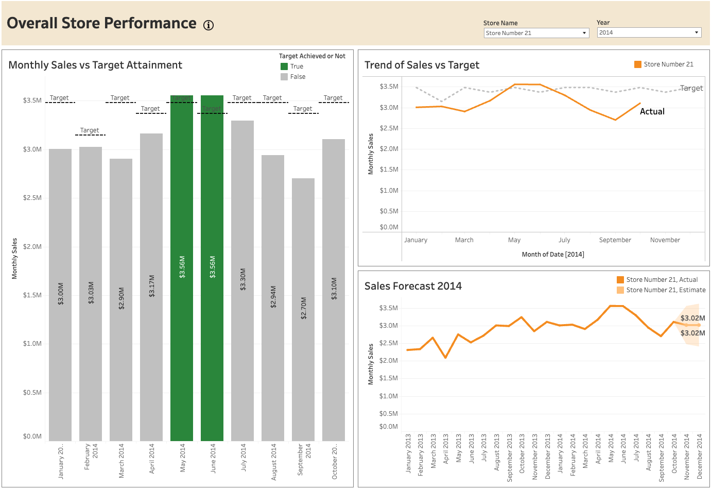

# IMT 577 Business Intelligence Systems - Final Project

## Project Overview

This repository contains the final project for my Business Intelligence Systems course in the MSIM program at the University of Washington. The objective of this project was to design and develop a comprehensive BI system, including a data warehouse and a visualization layer that addresses key business questions (KBQs). The project involved architecting the data warehouse from scratch in Snowflake, implementing an ETL process in SQL, designing a dimensional data model, and creating dashboards to derive insights and support decision-making related to store performance, product sales, and target achievement.

## Project Structure

The project files are organized as follows:
- /sql_scripts/
  - staging_tables.sql: SQL scripts to create and populate staging tables.
  - dimension_loads.sql: SQL scripts to load data into dimension tables.
  - fact_tables.sql: SQL scripts to create and load data into fact tables.
  - views.sql: SQL scripts to create secure views for business analysis and reporting.
- /project_resources/
  - dimensional_model_schema.png: Schema diagram illustrating the data warehouse design.
  - tableau_visualization.twbx: Tableau workbook with the final dashboard.
- /raw_data/
  - Contains multiple raw data files used in this project

## Tools & Technologies

- Database: Snowflake
- Data Modeling: Star Schema
- ETL: SQL-based data transformation
- Visualization: Tableau

## Schema Diagram

## Data Visualization
The dashboard is hosted on Tableau Public ([Link](https://public.tableau.com/app/profile/arnav.kulkarni/viz/IMT577_DW_ARNAV_KULKARNI_DASHBOARD_STORY/RetailStoreAnalysis)) and can also be downloaded from the /project_resources/ folder.

## Key Business Questions Addressed

1. Give an overall assessment of Stores number 10 and 21’s sales.  
   a. How are they performing compared to target? Will they meet their 2014 target?  
   b. Should either store be closed? Why or why not?  
   c. What should be done in the next year to maximize store profits?

2. Recommend 2013 bonus amounts for each store if the total bonus pool is $2,000,000 using a comparison of 2013 actual sales vs. 2013 sales targets as the basis for the recommendation.

3. Assess product sales by day of the week at stores 10 and 21. What can we learn about sales trends?

4. Should any new stores be opened? Include all stores in your analysis if necessary. If so, where? Why or why not?

## Acknowledgments
This project was completed as part of the Business Intelligence Systems course (IMT 577) in the MSIM program at the Information School, University of Washington. Special thanks to the course instructors and peers for their support and feedback.
